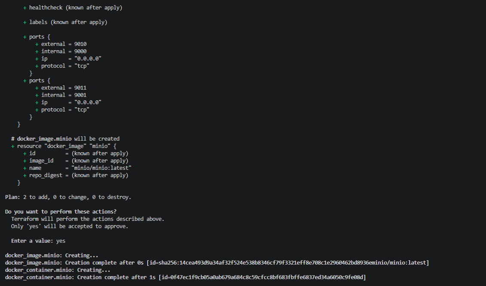
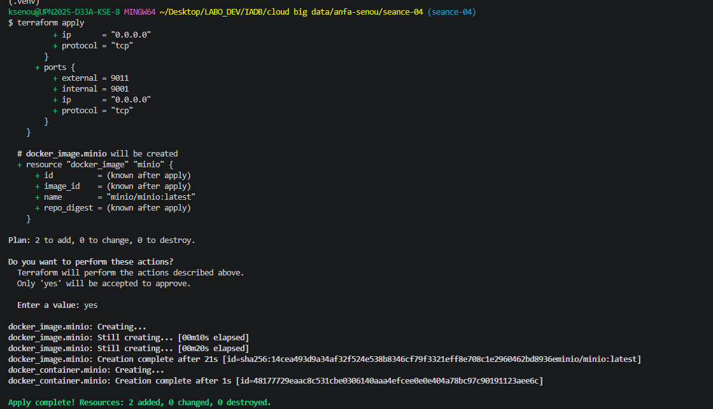
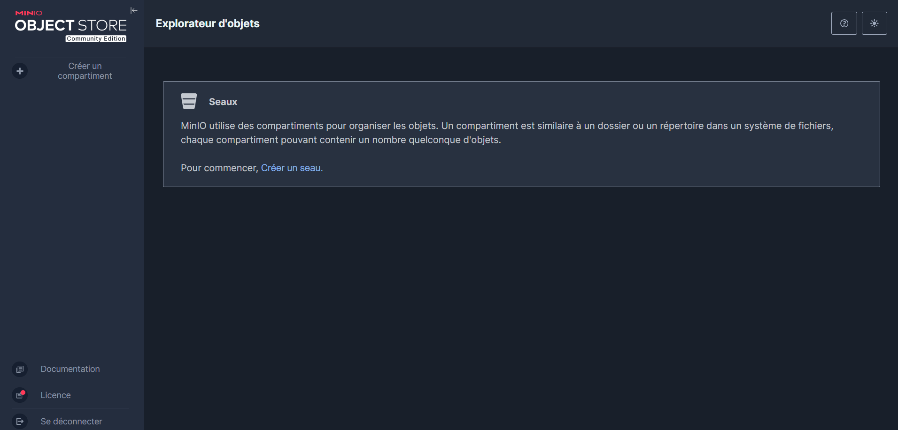
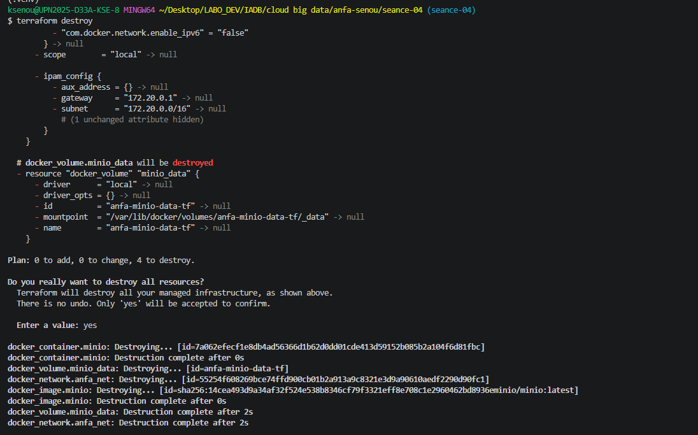

# Rendu --- Seance 4 
**Nom et prenom :** SENOU KOKOU AUDREY 
**Identifiant GitHub :** skai-shiroe 
**Date de soumission :** 27/06/2026 
## Resume de la seance 
Terraform installe, infrastructure Docker complete decrite en HCL, workflow plan/apply/destroy maitrise, code parametre via variables. 
## Etapes principales 
1. Installation de Terraform et premier main.tf minimal. 
2. Maitrise du workflow init -> plan -> apply -> destroy. 
3. Comprehension du state Terraform et bonnes pratiques de versioning. 
4. Stack complete : reseau, volume, conteneur MinIO. 
5. Refactoring en variables et fichier .tfvars. 
## Captures d.ecran 
### terraform plan (creation initiale) 
 
### terraform apply reussi 
 
### Console MinIO creee par Terraform 
 
### terraform destroy 
 
## Reponses aux exercices 
 
## Exercice 1 --- QCM conceptuel 
 
| Question | Reponse | Justification | 
|----------|---------|---------------| 
| 1.1 | **B** | L.IaC ne remplace pas la comprehension de l.infrastructure sous-jacente ; il faut toujours savoir ce que l.on fait pour ecrire du code correct. | 
| 1.2 | **B** | Le declaratif decrit **l.etat souhaite** (quoi) ; l.imperatif decrit la **sequence d.actions** (comment). | 
| 1.3 | **B** | Une operation idempotente produit le **meme resultat** quel que soit le nombre de fois ou elle est appliquee. | 
| 1.4 | **B** | Un provider est un **plugin** qui sait communiquer avec une API specifique (AWS, Docker, Kubernetes...). | 
| 1.5 | **B** | Terraform compare le **state** au code, ne voit aucun ecart, et **n.effectue aucune action** si rien n.a change. | 
| 1.6 | **C** | Le terraform.tfstate memorise ce que Terraform a cree pour permettre les changements **incrementaux**. | 
| 1.7 | **B** | Le state peut contenir des **secrets en clair** et etre **corrompu** par des commits concurrents. | 
| 1.8 | **C** | terraform plan permet de verifier ce qui va changer **avant** d.appliquer. | 
| 1.9 | **B** | OpenTofu est un **fork open source** de Terraform cree apres le changement de licence HashiCorp en 2023. | 
| 1.10 | **B** | **Non** --- Terraform **provisionne** l.infrastructure, Ansible **configure** des machines existantes, ils sont **complementaires**. | 
 
## Difficultes rencontrees 
Aucune difficulte majeure. Le workflow Terraform init-plan-apply-destroy est bien compris. 
 
## Exercice 2 --- Analyse Terraform (Docker Provider) 
 
### 2.1 Liste des 4 ressources et leur role 
 
1. docker_network.back - Cree un reseau Docker nomme anfa-backend pour connecter les conteneurs entre eux. 
2. docker_volume.data - Cree un volume Docker persistant pour stocker les donnees PostgreSQL. 
3. docker_image.postgres - Telecharge et gere l.image Docker postgres:15 depuis Docker Hub. 
4. docker_container.db - Cree et execute un conteneur PostgreSQL connecte au reseau et utilisant le volume. 
 
### 2.2 Signification de docker_image.postgres.image_id 
 
docker_image.postgres.image_id est une reference dynamique a l.image Docker telechargee par Terraform. 
Avantage par rapport a postgres:15 : 
- Assure que l.image est deja pullee et disponible localement 
- Garantit une version exacte et immuable de l.image 
- Evite les problemes lies aux tags qui peuvent changer (ex: latest) 
 
### 2.3 Ordre de creation des ressources 
 
Ordre de creation : 
1. docker_image.postgres 
2. docker_network.back 
3. docker_volume.data 
4. docker_container.db 
Justification : 
Terraform construit un graphe de dependances. Le conteneur depend de l.image, du reseau et du volume, donc ces ressources doivent exister avant lui. 
 
### 2.4 Probleme de securite principal et correction 
 
Probleme : Les identifiants PostgreSQL sont ecrits en dur dans le code (POSTGRES_PASSWORD = secret123). Cela expose des secrets sensibles dans le code source. 
 
Correction (bonne pratique) : 
1. Utiliser des variables Terraform avec sensitive = true 
2. Definir le mot de passe dans un fichier terraform.tfvars 
3. Ne jamais committer les secrets dans Git 
4. Utiliser les variables dans le bloc env du conteneur 
 
### 2.5 Comportement apres destroy + modification du port 
 
Etapes : 
1. terraform destroy - Supprime toute l.infrastructure (conteneur, reseau, volume, image) 
2. Modification du port de 5432 a 5433 dans le code 
3. terraform apply - Recree toute l.infrastructure avec le nouveau port 5433 
## Difficultes rencontrees 
Aucune difficulte majeure. Le workflow Terraform init-plan-apply-destroy est bien compris. 
 
## Exercice 3 --- Diagnostic Terraform 
 
### 3.1 - L.apply qui echoue avec une dependance circulaire 
 
a. Signification de l.erreur : Terraform detecte une dependance circulaire (cycle) entre deux ressources. 
b. Pourquoi Terraform refuse : Parce qu.il est impossible de determiner quel conteneur doit etre cree en premier (A depend de B, B depend de A - boucle infinie logique). 
c. Solution : Casser la dependance circulaire. Exemple : ne pas faire referencer les conteneurs entre eux de maniere cyclique, utiliser une valeur externe ou une configuration apres creation. 
 
### 3.2 - Le plan qui veut tout recreer 
 
a. Pourquoi -/+ au lieu de ~ ? Parce que Terraform considere le changement comme destructif pour docker_container. Modifier env entraine souvent une recreation complete du conteneur car Docker provider ne supporte pas toujours les updates in-place. 
b. Les donnees seront-elles perdues ? Non, si les donnees sont sur un volume Docker persistant. Oui, si les donnees sont dans le conteneur. 
c. Impact en production : Non, ce n.est pas gratuit. Il y a interruption du service (downtime), redemarrage du conteneur, possible perte temporaire de disponibilite. 
 
### 3.3 - Le state corrompu 
 
a. Probleme de securite : Le fichier terraform.tfstate peut contenir des mots de passe, cles API, informations sensibles. Exposition publique sur GitHub = fuite de secrets. 
b. Risque technique : Un apply avec un etat non synchronise peut ecraser ou supprimer des ressources existantes, provoquer une desynchronisation complete de l.infrastructure. 
c. Solution perenne : Utiliser un remote backend securise (ex: S3 + DynamoDB, Terraform Cloud, OVH Object Storage + locking) 
 
## Exercice 4 --- Adaptation Docker Compose vers Terraform 
 
Ressources necessaires : 
- 1 reseau Docker 
- 1 volume MinIO 
- 1 image MinIO 
- 1 image Jupyter 
- 1 conteneur MinIO 
- 1 conteneur Jupyter 
- 1 variable sensible pour le mot de passe MinIO 
 
Squelette Terraform : 
 
terraform { 
  required_providers { 
    docker = { 
      source  = kreuzwerker/docker 
      version = ~> 3.0 
    } 
  } 
} 
 
provider docker {} 
 
# Reseau partage 
resource docker_network anfa { 
  name = anfa-network 
} 
 
# Volume MinIO 
resource docker_volume minio_data { 
  name = minio-data 
} 
 
# Image MinIO 
resource docker_image minio { 
  name = minio/minio:latest 
} 
 
# Image Jupyter 
resource docker_image jupyter { 
  name = jupyter/scipy-notebook:latest 
} 
 
# Variable sensible 
variable minio_password { 
  type      = string 
  sensitive = true 
} 
 
# Conteneur MinIO 
resource docker_container minio { 
  name  = anfa-minio 
  image = docker_image.minio.image_id 
  ports { 
    internal = 9000 
    external = 9000 
  } 
  ports { 
    internal = 9001 
    external = 9001 
  } 
  env = [ 
    MINIO_ROOT_USER=anfa-admin, 
    MINIO_ROOT_PASSWORD=${var.minio_password} 
  ] 
  volumes { 
    volume_name    = docker_volume.minio_data.name 
    container_path = /data 
  } 
  networks_advanced { 
    name = docker_network.anfa.name 
  } 
} 
 
# Conteneur Jupyter 
resource docker_container jupyter { 
  name  = anfa-jupyter 
  image = docker_image.jupyter.image_id 
  ports { 
    internal = 8888 
    external = 8888 
  } 
  env = [ 
    JUPYTER_TOKEN=anfa-token 
  ] 
  networks_advanced { 
    name = docker_network.anfa.name 
  } 
} 
 
## Exercice 5 --- Mini-cas architecture cloud 
 
### 5.1 Types de ressources Terraform 
- Un bucket de stockage objet (CSV, logs) 
- Un cluster Kubernetes manage 
- Une base de donnees managee (PostgreSQL) 
- Un service de calcul scalable (VM ou autoscaling group) 
- Un service de monitoring (Grafana / Prometheus) 
- Un reseau cloud (VPC / subnet) 
 
### 5.2 Structure du projet 
Reponse : B (multi-fichiers) - plus lisible, plus maintenable, meilleure collaboration, separation des responsabilites. 
 
### 5.3 Gestion dev / prod 
Deux mecanismes Terraform : 
- Workspaces 
- Variables d.environnement / tfvars 
 
### 5.4 Migration AWS vs OVH 
Migration non triviale. Terraform abstrait une partie du code mais chaque provider est different. 
A adapter : ressources cloud specifiques, networking, services manages. 
Conclusion : migration = effort important, pas automatique. 
 
### 5.5 Bonnes pratiques equipe 
- Utiliser un remote state (Terraform Cloud / S3) 
- Utiliser des modules Terraform 
- Mettre en place un Git workflow (branches + PR + code review) 
- Ne jamais committer les secrets (tfstate, passwords) 
- Utiliser terraform plan avant chaque apply 
