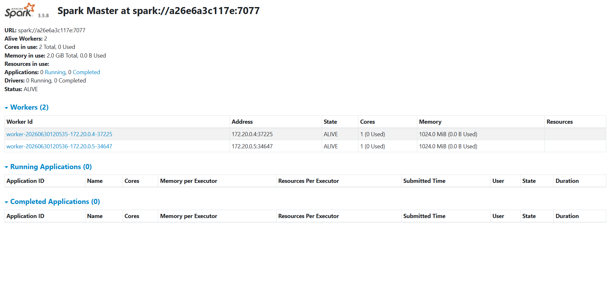
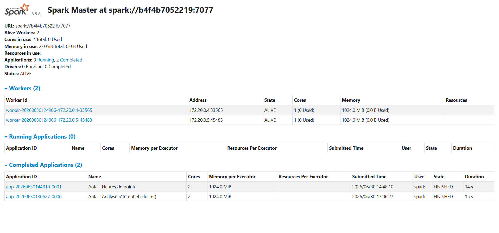
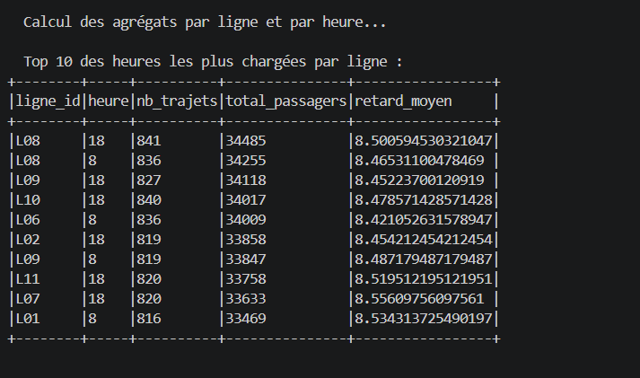
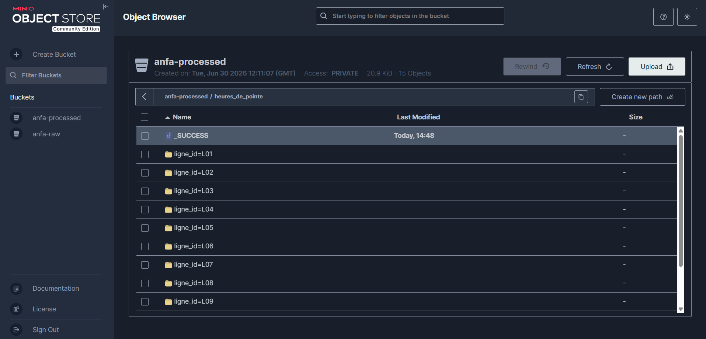

# Rendu Séance 5
**Nom et prénom :** SENOU KOKOU AUDREY

## Résumé de la séance
Cluster Spark standalone (1 master + 2 workers) déployé via Docker Compose. MinIO utilisé comme stockage objet pour les données brutes et les résultats. Deux jobs PySpark exécutés en mode distribué : analyse statistique du référentiel de lignes/arrêts, puis analyse des heures de pointe par ligne à partir d'un historique de trajets simulé. Comparaison subjective entre exécution locale (Spark en mode local) et exécution sur le cluster.

## Étapes principales
1. Déploiement du cluster Spark standalone (1 master + 2 workers) via Docker Compose.
2. Préparation de MinIO et upload du référentiel.
3. Premier job distribué (`analyse_referentiel_cluster.py`) : statistiques de base.
4. Génération d'un historique simulé de trajets et job d'analyse des heures de pointe.
5. Comparaison subjective entre mode local et mode cluster.

## Captures d'écran
### Dashboard Spark Master avec 2 workers

### Application Spark exécutée avec succès

### Résultats du Top 10 dans la console

### Bucket anfa-processed avec heures_de_pointe partitionné

## Réflexion : local vs cluster

### Temps d'exécution observé
- **Mode local** (Spark en `local[*]`) : exécution rapide sur les petits volumes, démarrage quasi-instantané. Pas de latence réseau.
- **Mode cluster** (3 nœuds Docker) : temps d'exécution légèrement plus long à cause du démarrage des workers, de la résolution DNS, du téléchargement des dépendances JAR Hadoop-AWS via Ivy, et des allers-retours réseau vers MinIO. Cependant, la différence est peu perceptible sur des données de faible volume (référentiel + trajets simulés).

### Différences perçues entre les deux approches
| Critère | Mode local | Mode cluster |
|---|---|---|
| **Simplicité** | Aucune configuration réseau, tout tient dans un seul processus | Nécessite Docker Compose, configuration des workers, réseau, DNS |
| **Dépendances** | Les JAR Hadoop/S3A sont gérées automatiquement par Spark | Il faut spécifier `--packages` ou `spark.jars.packages` et attendre le téléchargement Ivy |
| **Montée en charge** | Limitée par les ressources de la machine (1 processeur, RAM disponible) | Distribué sur 2 workers, scalable horizontalement |
| **Débogage** | Console unique, logs centralisés | Logs répartis sur plusieurs conteneurs, nécessite d'inspecter chaque worker |
| **Stockage** | Fichiers locaux | MinIO (S3-compatible), nécessite les librairies hadoop-aws |
| **Reproductibilité** | Dépend de l'environnement local | Environnement conteneurisé, reproductible à l'identique |

### Quel mode utiliser pour quelle situation ?
- **Mode local** : idéal pour le développement rapide, le prototypage, les tests unitaires, et les petits volumes de données (< 1 Go). Permet d'itérer vite sans overhead d'infrastructure.
- **Mode cluster** : indispensable pour les volumes de données importants (plusieurs Go à To), les traitements en production, et quand on veut distribuer la charge sur plusieurs nœuds. Utile aussi pour valider le comportement distribué d'un job avant de le déployer sur un vrai cluster (EMR, Databricks, Kubernetes).

## Bonus Spark sur Kubernetes
Non réalisé.

## Réponses aux exercices d'application
*À compléter d'après les énoncés fournis avec l'assignment.*

## Difficultés rencontrées
1. **Résolution DNS dans les conteneurs Spark** : les conteneurs Spark ne parvenaient pas à résoudre les noms DNS externes (pypi.org), ce qui bloquait l'installation de `boto3` avec pip. Résolu en ajoutant `dns: 192.168.137.1` (DNS de l'hôte) dans le `docker-compose.yml` pour les 3 services Spark.
2. **Syntaxe PowerShell pour les commandes multi-lignes** : l'utilisation de `\` (backslash) pour les retours à la ligne dans `docker exec` n'est pas valide sous PowerShell. Le `\` est interprété comme un séparateur de chemin Windows, ce qui a causé l'erreur `File file:/opt/spark/work-dir/\--master does not exist`. Solution : exécuter la commande sur une seule ligne ou utiliser le backtick `` ` `` de PowerShell pour la continuation.