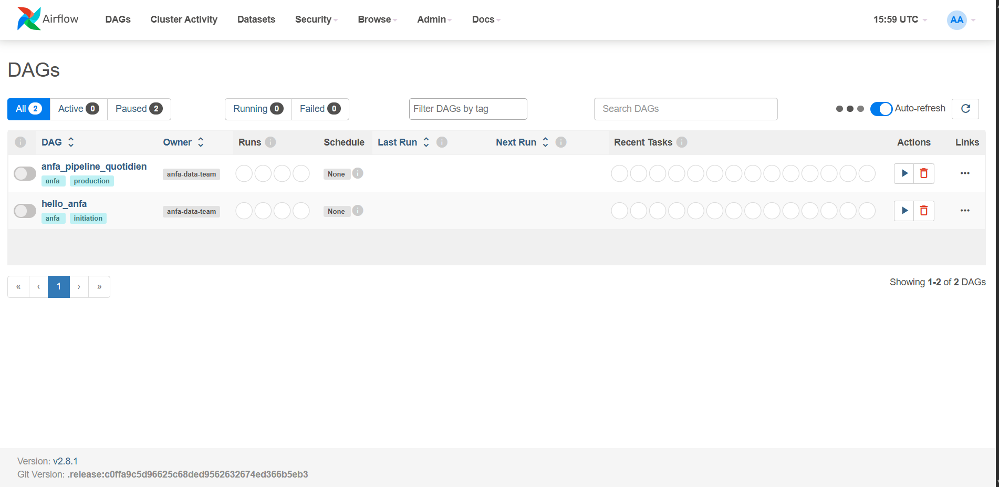
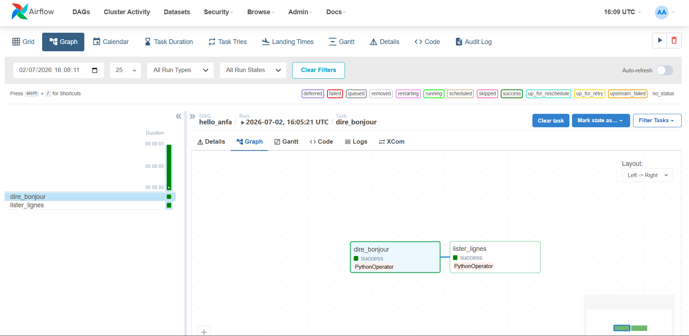
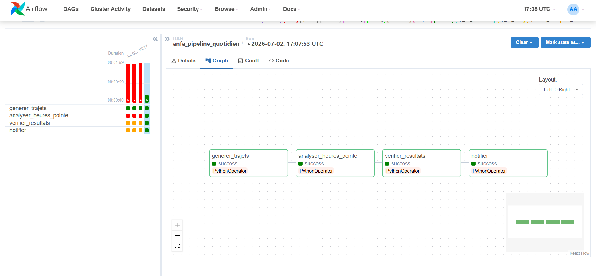
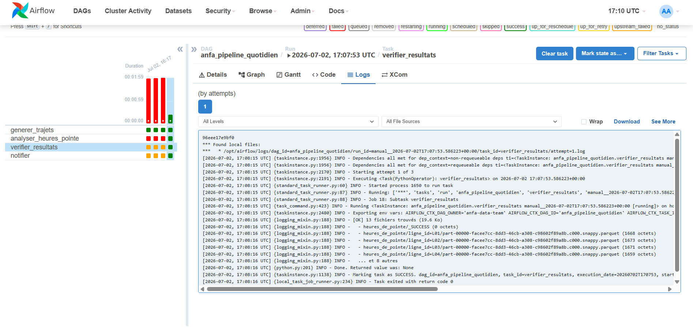
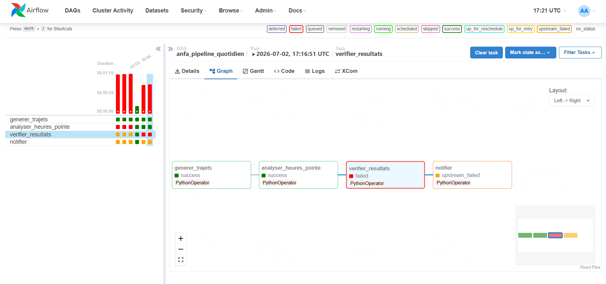

# Rendu : Séance 6

**Nom et prénom :** SENOU Kokou Audrey
**Identifiant GitHub :** skai-shiroe
**Date de soumission :** 02/07/2026

## Résumé de la séance

Airflow déployé via Docker Compose aux côtés de MinIO et Spark. Un premier DAG
simple (`hello_anfa`) a servi à comprendre la mécanique, puis un DAG métier
(`anfa_pipeline_quotidien`) orchestre le pipeline de la séance 5 :
génération → analyse Spark → vérification → notification. Les retries et la
propagation d'échec ont été observés via un bug volontaire.

## Étapes principales

1. Déploiement de la stack (Airflow + PostgreSQL + MinIO + Spark) via Docker Compose.
2. Premier DAG `hello_anfa` à 2 tâches : initiation à la mécanique Airflow.
3. DAG métier `anfa_pipeline_quotidien` à 4 tâches : génération → Spark → vérification → notification.
4. Démonstration des retries et de la gestion d'erreur via un bug volontaire.

## Captures d'écran

### UI Airflow après connexion (vue d'accueil)

### DAG hello_anfa exécuté en succès

### DAG anfa_pipeline_quotidien complet en succès

### Logs de la tâche `verifier_resultats`

### Démonstration du retry : tâche en échec et propagation

## Réflexion personnelle

Un simple cron permet d'exécuter une commande à une heure précise, mais il ne gère pas les dépendances entre plusieurs tâches, le suivi des exécutions, les reprises automatiques après un échec ni la visualisation des workflows. Apache Airflow orchestre des pipelines complets en définissant l'ordre d'exécution des tâches, en gérant les erreurs, les tentatives de relance (retries), les notifications et l'historique via une interface web. Sur un projet réel, Airflow est particulièrement adapté aux pipelines ETL/ELT, aux traitements de données, aux workflows d'IA ou aux automatisations composées de plusieurs étapes dépendantes nécessitant fiabilité, supervision et évolutivité.

## Difficultés rencontrées

<Aucune | Décrivez brièvement.>
Avec Airflow (surtout couplé à Spark, Docker, MinIO), les difficultés les plus fréquentes sont :

Complexité de configuration : beaucoup de paramètres (executor, connexions, variables, DAGs), ce qui rend le setup fragile au début.

Gestion des dépendances et du réseau : erreurs de DNS, proxy ou accès Internet (comme ton problème Maven) qui bloquent les tâches sans lien direct avec le code.

Debug difficile : une erreur peut venir du DAG, du conteneur, de Spark ou du système, donc il faut naviguer entre plusieurs logs.

