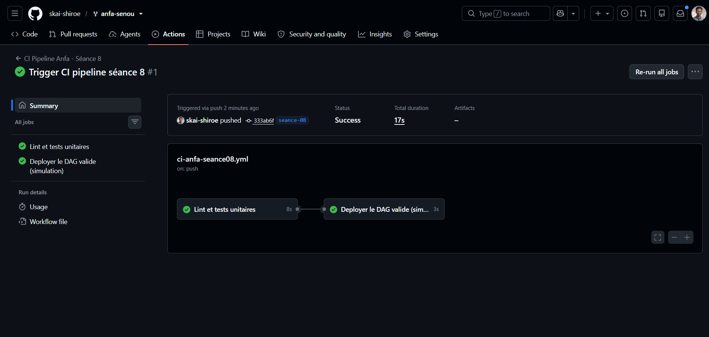
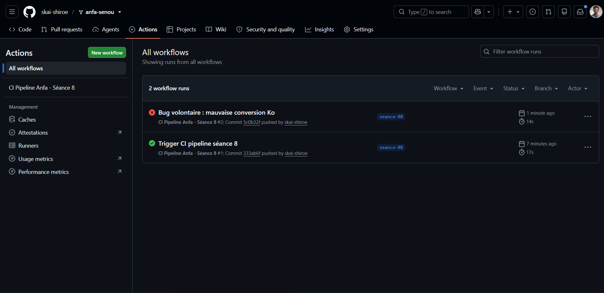

# Rendu — Séance 8

**Nom et prénom :** SENOU K AUDREY
**Identifiant GitHub :** skai-shiroe
**Date de soumission :** 06/07/2026

## Résumé de la séance

<2-4 lignes : logique métier séparée et testée, pipeline CI/CD GitHub Actions
écrit, démonstration d'un test bloquant le déploiement.>

## Étapes principales

1. Séparation de la logique métier (`anfa_logic.py`) du DAG Airflow.
2. Écriture de 5 tests unitaires avec pytest.
3. Écriture du workflow GitHub Actions (lint + tests + déploiement simulé).
4. Démonstration : un bug volontaire bloque le déploiement ; correction et succès.

## Captures d'écran

### Workflow réussi (2 jobs)

### Job en échec, déploiement non exécuté

## Réflexion personnelle

<3-5 lignes : en quoi ce pipeline aurait-il empêché l'incident de Mawuli
(situation-problème du CM) ? Qu'est-ce que `needs:` change concrètement ?>

Ce pipeline aurait empêché l’incident de Mawuli en détectant automatiquement les erreurs dans le DAG avant son déploiement grâce aux étapes de lint et de tests unitaires. Le DAG n’aurait été déployé que si les validations étaient réussies. La directive needs: crée une dépendance entre les jobs : elle impose que le job de validation termine avec succès avant d’exécuter le job de déploiement, évitant ainsi de propager une version défectueuse en production.

## Difficultés rencontrées

<Aucune | Décrivez brièvement.>
