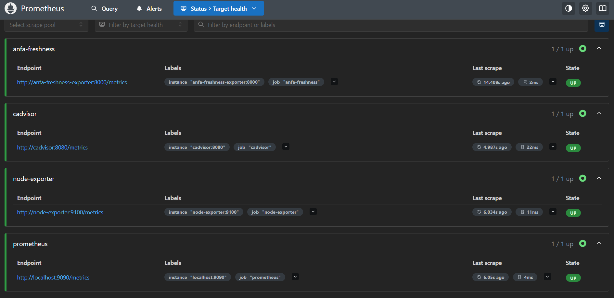
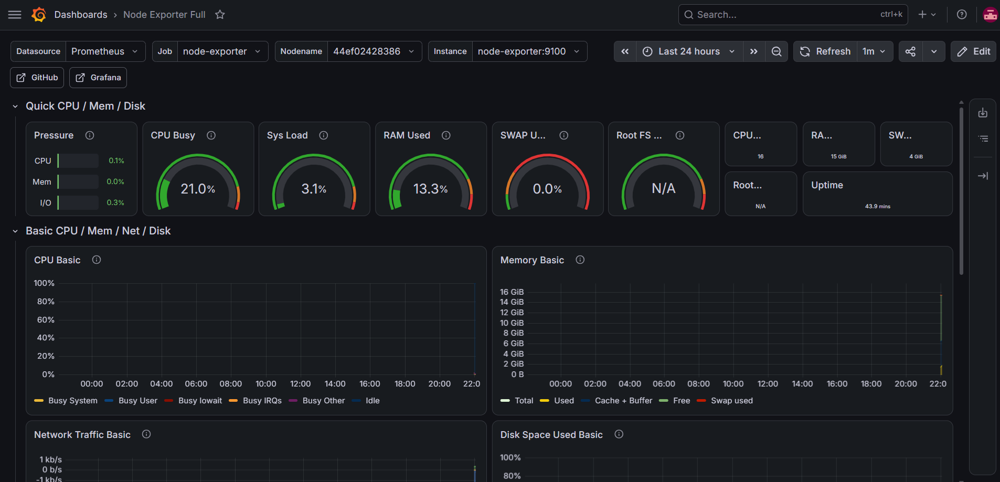
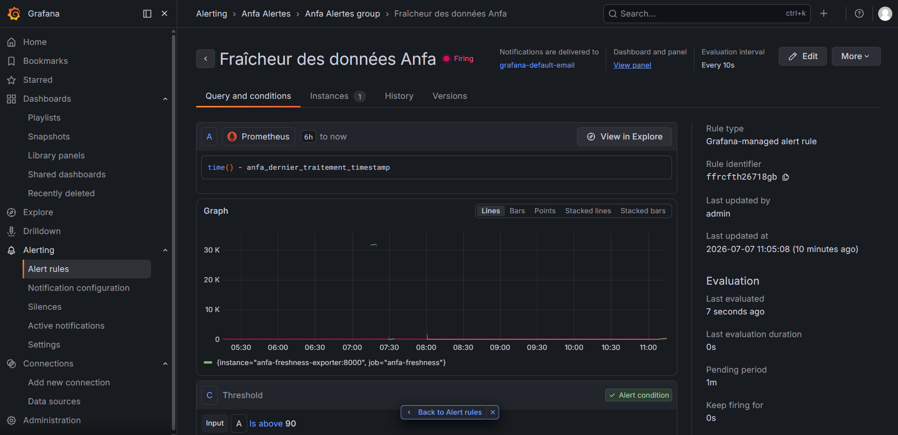

# Rendu — Séance 9

**Nom et prénom :** SENOU KOKOU AUDREY
**Identifiant GitHub :** skai-shiroe
**Date de soumission :** 07/07/2026

## Résumé de la séance

<2-4 lignes : stack Prometheus/Grafana déployée, exportateur de fraîcheur Anfa
instrumenté, dashboard construit, alerte configurée et déclenchée sur panne simulée.>

Au cours de cette séance, la stack de monitoring Prometheus/Grafana a été déployée afin de superviser la fraîcheur des données du pipeline Anfa. Un exportateur de métrique de fraîcheur a été instrumenté, puis un dashboard Grafana avec une jauge de suivi a été construit. Une alerte basée sur le dépassement d’un seuil de fraîcheur a été configurée et testée avec une panne simulée du pipeline.

## Étapes principales

1. Déploiement de Prometheus, Node Exporter, cAdvisor, Grafana et d'un exportateur
   métier custom (fraîcheur des données Anfa).
2. Exploration des cibles Prometheus et premières requêtes PromQL.
3. Import du dashboard "Node Exporter Full" et construction d'un panneau custom.
4. Configuration d'une alerte Grafana sur la fraîcheur des données.
5. Simulation d'une panne silencieuse et observation du déclenchement de l'alerte.

## Captures d'écran

### Les 4 cibles Prometheus à l'état UP

### Dashboard "Node Exporter Full" importé

### Alerte à l'état Firing après panne simulée

## Réflexion personnelle

<3-5 lignes : en quoi cette séance répond-elle directement à la situation-problème
d'Awa dans le CM ? Qu'est-ce que la métrique de fraîcheur vous a permis de voir que
les autres métriques (CPU, RAM, statut des conteneurs) ne montraient pas ?>

Cette séance répond directement à la situation-problème d’Awa en permettant de détecter un pipeline qui continue de fonctionner techniquement mais qui ne produit plus de données fraîches. La métrique de fraîcheur a permis de voir que les résultats n’étaient plus mis à jour, alors que les métriques classiques comme le CPU, la RAM ou le statut des conteneurs pouvaient indiquer que tout semblait normal. Elle apporte donc une vision métier de la santé du pipeline et permet de déclencher une alerte avant que l’incident ne soit visible par les utilisateurs.

## Difficultés rencontrées

La principale difficulté a été la configuration de l’alerte Grafana (création du groupe d’évaluation, association du contact point et adaptation de la requête PromQL). Il a également fallu comprendre la différence entre une métrique de timestamp et une métrique de fraîcheur calculée avec time() - anfa_dernier_traitement_timestamp. Ces ajustements ont permis d’obtenir une visualisation correcte et une alerte fonctionnelle.
