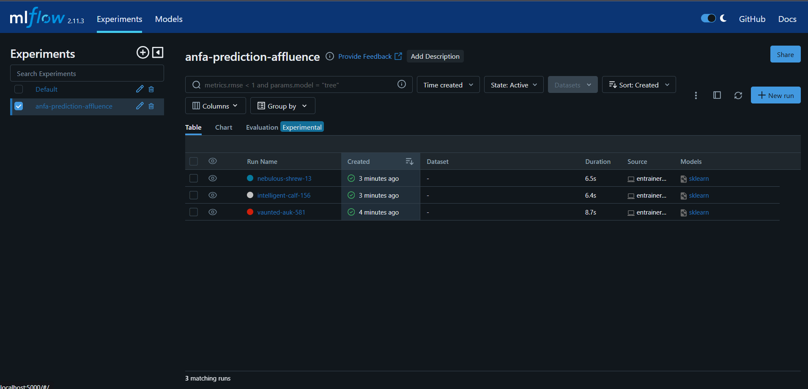
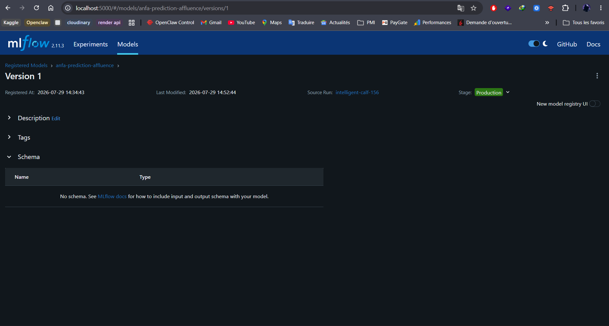

# Rendu — Séance 10

**Nom et prénom :** SENOU KOKOU AUDREY
**Identifiant GitHub :** skai-shiroe
**Date de soumission :** 29/07/2026

## Résumé de la séance

Nous avons déployé un serveur MLflow Tracking et généré un jeu de données d'affluence pour 
Anfa. Trois modèles RandomForest avec hyperparamètres différents ont été entraînés et tracés 
dans MLflow. Le meilleur modèle a été identifié via l'UI et enregistré dans le Model Registry 
sous le nom anfa-prediction-affluence, puis promu en Production après comparaison des métriques.

## Étapes principales

1. Déploiement d'un serveur MLflow Tracking avec SQLite et stockage local des artefacts.
2. Génération du dataset d'affluence et entraînement de 3 variantes de RandomForest avec 
   MLflow (n_estimators et max_depth variables).
3. Visualisation et comparaison des runs dans l'interface MLflow pour sélectionner le 
   meilleur modèle selon le MSE.
4. Enregistrement du modèle choisi dans le Model Registry et transition au statut Production.
5. Rédaction d'une fiche de conformité RGPD pour un cas d'usage d'application mobile Anfa.

## Captures d'écran

### Tableau des 3 runs comparés

### Modèle enregistré en statut Production

## Réflexion personnelle

Le Model Registry résout directement la problématique de Kossi en offrant un système de 
versionnement des modèles ML équivalent à Git pour le code. Cela permet de tracer les 
expériences, comparer les performances et promouvoir en production de manière contrôlée. 
Cette approche complète le versionnement d'infrastructure réalisé avec Terraform en séance 4 : 
ensemble, ils constituent une chaîne complète de traçabilité et de gouvernance pour un 
service IA, depuis l'infrastructure jusqu'au modèle lui-même.

## Difficultés rencontrées

Compatibilité de Python 3.13 avec pyarrow et setuptools résolue par l'utilisation d'un 
environnement virtuel Python 3.11 disposant des versions de packages compatibles.